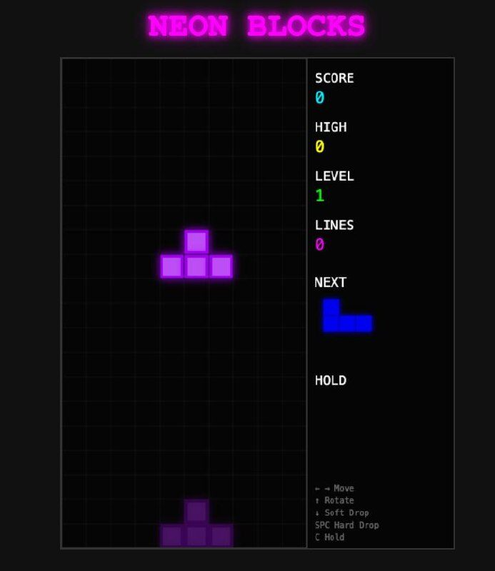

# Web Games Arcade

🎮 **[Play now → simiono.com/games/](https://simiono.com/games/)** | [GitHub Pages Mirror](https://utrost.github.io/webGames/)

A collection of seven browser-based games built with vanilla JavaScript and HTML5 Canvas. Neon-retro aesthetic, no frameworks, minimal dependencies.

[How to play](docs/how-to-play.md) covers the current mouse, keyboard, and touch controls for every game. [New game checklist](docs/new-game-checklist.md) defines the quality gate for additional classics.



**Note:** Void Crawler has been split into its own standalone repository: [utrost/void-crawler](https://github.com/utrost/void-crawler).

## Games

| Game | Genre | Status |
|---|---|---|
| **Neon Flow** | Puzzle / Routing | ✅ v1.0 |
| **Cosmic Breaker** | Breakout / Arcade | ✅ v1.0 |
| **Orbit** | Physics / Survival | ✅ v1.0 |
| **Asteroids** | Shooter / Arcade | ✅ v1.0 |
| **Neon Blocks** | Tetris / Puzzle | ✅ v1.0 |
| **Elemental Sandbox** | Falling Sand / Sim | ✅ v1.0 |

## Key Features

- **Hub Lobby**: Browse, select, and seamlessly transition between games without page reloads.
- **Achievements System**: Cross-game achievement tracking with toast notifications.
- **Settings & Stats**: Global volume control, color-blind mode, and session statistics tracking.
- **Progressive Web App (PWA)**: Includes a service worker for offline play.
- **Cross-Platform Input**: Mouse, Keyboard, Touch, and Gamepad support.

## Tech Stack

- **Vanilla JS** (ES modules, no frameworks)
- **HTML5 Canvas** for rendering
- **Web Audio API** for sound synthesis
- **Vite** for dev server and build
- **Vitest** for unit testing
- **ESLint** + **Prettier** for code quality
- Custom shared engine: GameLoop, InputManager, AudioManager, Vector2, StorageManager, ParticleSystem, StateMachine, StatsTracker, PerfMonitor

## Architecture

Hub-and-Spoke monorepo. A shared `core/` engine powers individual game modules under `src/games/`.

```
src/
├── core/                    # Shared engine modules
│   ├── GameLoop.js          # Frame timing with delta time
│   ├── Vector2.js           # 2D math library (add, scale, rotate, normalize, etc.)
│   ├── AudioManager.js      # Web Audio API wrapper (tones + sound buffers)
│   ├── StorageManager.js    # localStorage persistence (high scores, settings)
│   ├── ParticleSystem.js    # Emit/update/render particle effects
│   ├── StateMachine.js      # State transitions with enter/exit callbacks
│   ├── StatsTracker.js      # Session statistics and play time tracking
│   ├── PerfMonitor.js       # FPS counter overlay (F3 to toggle)
│   ├── CanvasScaler.js      # Responsive canvas with DPI scaling
│   ├── GamepadManager.js    # Gamepad API support
│   └── __tests__/           # Core module tests
├── games/                   # Game modules
│   ├── asteroids/           # Vector neon shooter
│   ├── cosmic-breaker/      # Breakout clone with power-ups
│   ├── elemental-sandbox/   # Falling sand cellular automata
│   ├── neon-blocks/         # Tetris with neon aesthetic
│   ├── neon-flow/           # Pipe routing puzzle with color mixing
│   └── orbit/               # Gravity physics survival
└── main.js                  # Lobby, game registry, achievements
```

Each game implements a standard interface (`constructor(container, onGameOver)`, `init()`, `stop()`) for lobby load/unload.

See [architecture.md](architecture.md) for full details, [games.md](games.md) for game specs, [src/games/README.md](src/games/README.md) for the cartridge layout, and each game folder's `DESIGN.md` for code-level design notes.

## Development

```bash
npm install
npm run dev       # Start dev server (hot reload)
npm run build     # Production build → dist/
npm run preview   # Preview production build
```

## Testing

Tests use [Vitest](https://vitest.dev/) and cover core engine modules and game logic.

```bash
npm test              # Run all tests once
npm run test:watch    # Run tests in watch mode
```

**Test coverage:** 264 tests across 27 test files covering the shared core, responsive layout contract, input modality support, controls/help documentation, lifecycle contracts, code-design documentation, new-game quality gate documentation, and all seven game cartridges.

Key areas:
- Core: Vector2, StorageManager, GameLoop, StateMachine, ParticleSystem, PerfMonitor, StatsTracker, InputManager, AudioManager, CanvasScaler, ResponsiveLayout
- Games: Asteroids entities, Cosmic Breaker levels, Neon Blocks shapes/gameplay, Neon Flow logic, Orbit physics, Elemental Sandbox simulation

## Prerequisites

- Node.js 18+
- npm

## Contributing

See [CONTRIBUTING.md](CONTRIBUTING.md).

## License

[AGPL-3.0](LICENSE)
